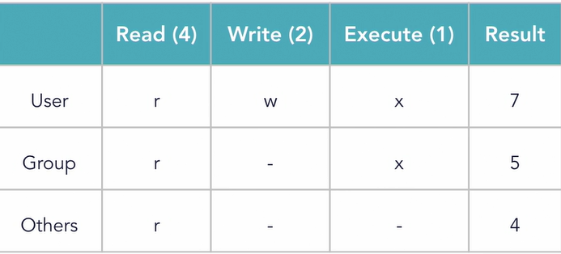
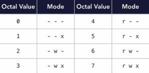

# Linux 

* General Command Syntax :
   - **Command  Option(s)   Arguments** 
   - 1. ls -lh /user/bin
     2. sort user.txt
     3. grep -i "needle" haystack

* File and Folders
   1. **file** -> syntax : file *filename*
        - Determines file type, examines file contents rather than its name or extension to identify what kind of file it is.
         - eg. file Linux_Notes
         - output ->  Linux_Notes : ASCII text
        
   2. **stat** -> syntax : stat *filename*
        -   display detailed information about file or file system like includes information like the file's size, permissions, owner, modification time, etc.
        -   eg. stat Linux_Notes
        -   output -> 

* **ls command working** :
   1. **ls -R departments** : The *ls -R departments*  lists all files and directories within a specified directory and does so recursively, i.e it will include the contents of all subdirectories as well.
        - output -> 
   2. **ls -l** : *ls -l* lists the contents of a directory in long format. This long listing format provides detailed information about each file or directory.
        - output->  
            | Field                | Example Value      | Description                                                                                       |
            |----------------------|--------------------|---------------------------------------------------------------------------------------------------|
            | **File Type & Permissions** | `-rwxrwxrwx`      | Indicates the type of file and the permissions for user, group, and others.                       |
            | **Number of Links**          | `1`                | Number of hard links to the file or directory.                                                    |
            | **Owner (User)**             | `yash`            | The user who owns the file.                                                                       |
            | **Group**                   | `yash`           | The group that owns the file.                                                                     |
            | **File Size**               | `1474`             | Size of the file in bytes.                                                                        |
            | **Modification Date & Time**| `June 19 2018`     | Date and time when the file was last modified.                                                    |
            | **File Name**               | `poems.txt`      | The name of the file or directory.                                                                |
            

*   **Create and Remove Folders**

       1. Create Folder : *mkdir foldername* Creates folder in current working directory.
             - eg. *mkdir yash_docs*
             * if I want to create folder inside another folder of current working directory
                  -   *mdkir yash_docs/college/Marksheets*
             * if we want to create folder with sub folder inside it we need to pass option in command
                  - *mkdir -p yash_docs/college/DBMS_LAB/Practicals*
                    
       2. Remove Folder: *rmdir foldername* removes empty folder ( removes folder only when empty)
             - eg. *rmdir new_folder*

* **Copy File and Folder**
     1. Copying file: *cp originalfile copyfile* creates copy of *originalfile* with name *copyfile name*
        - eg 1. *cp file1.txt file1_copy.txt* 
        - eg 2. *cp file1.txt departments/images/file1_copy.txt*

     2. Copying folder: *cp -r originalfolder copyfolder* creates copy of *originalfolder* with name copyfolder*
        - eg 1. *cp -r folder1 copyfolder1*
        - eg 2. *cp -r folder1 departments/images/copyfolder2*

* **Moving file and folder**

     1. *mv file1.txt file2.txt* : move file in same directory and save it with name file2.txt
     2. *mv file1.txt departments/images/file2.txt* : move file from current working directory to different directory with name file2.txt
     3. *mv departments/images/file1.txt* : move file from different directory to current working directory with name file2.txt.
     4.  *mv \*.txt departments/images* : moves all the textfiles to images folder.
     5.  *mv departments/images/\* .* : moves all the files and folders in images to current working directory.
        
  **_NOTE:_**  Same can be used for moving folders. eg: **mv folder1 folder2**

* **Remove file and folder**
     1. *rm file.txt* : removes file.txt
     2. *rm -r departments* : removes folder from current working directory

* **Find** : Used to search for files and directories within a directory hierarchy.
     - Syntax : *find <path> <options> <expression>
        - path : Specifies the directory or directories in which to start the search
        - options : Control the behavior of the find command, such as limiting the depth of the search or controlling the output.
        - expression : criteria for matching files or directories. These can include name patterns, file sizes, modification times, ownership, permissions, etc.

     - eg. *find . -name "po\*"* : searches for folder or directories with name starting from po in current working directory and its subdirectories
     - eg. *find ~/Documents/departments -name "\*d\*"* 
     - eg. *find ~/Documents/departments -type f -name ".txt"*

* **File Permissions** : File permissions determine who can read, write, or execute a file or directory
     - file permission string has 10 characters.
          - first character indicate file type
          - next nine characters represents the permissions divided into three sets of three characters
               - Owner (user) permissions
               - Group permissions
               - Others permissions
          - eg. *ls -l sample.txt*
  
          - output->  

       - Changing file permission using *chmod* (change permissions on a file by modifying file mode bits) 
            1. using octal notation
            2. using symbolic notation
            
       - **OCTAL Notation**

          
         

          - Syntax : *chmod octalnotation filename*
            
            
       
       - **Symbolic Notation**
            * Symbolic notation uses letters to represent permissions and categories
                 1. Permissions
                    1. Read : r
                    2. Write : w
                    3. Execute : x
                 2. Categories:
                    1. User : u (owner)
                    2. Group : g
                    3. Others : o
                    4. All (user, group, and others) : a
                 3. Modifying Permissions : Permissions are modified using operators
                    1. Add permission : +
                    2. Remove permission : -
                    3. Set exact permissions : =
                   
               
               | Symbolic Command    | Permissions Set (`rwxrwxrwx`)    | Description |
               |---------------------|----------------------------------|-------------|
               | `chmod u+r`         | `r--------` (read for user)      | Adds read permission for the **user (owner)**      |
               | `chmod g+rw`         | `r--rw----` (write for group)    | Adds write permission for the **group**            |
               | `chmod o+rwx`         | `r--rw-rwx` (execute for others) | Adds execute permission for **others**             |
               | `chmod u+x,g+x`     | `r-xrwxrwx` (execute for user and group) | Adds execute permission for **user** and **group** |
               | `chmod u-rx`        | `---rwxrwx` (remove read/write for user) | Removes read and write permissions from **user**   |
               | `chmod g-x`         | `---rw-rwx` (remove execute for group) | Removes execute permission from **group**          |
               | `chmod a+rwx`         | `rwxrwxrwx` (read, write ,execute for all)       | Adds read permission for **all users** (user, group, others) |
               | `chmod u=rwx,g=rx,o=r` | `rwxr-xr--`(set permissions as given in command)                   | Sets **user** to full access, **group** to read/execute, **others** read-only |
               | `chmod o-rwx`       | `rwxr-x---` (remove all for others) | Removes all permissions from **others**            |

