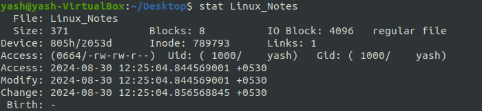
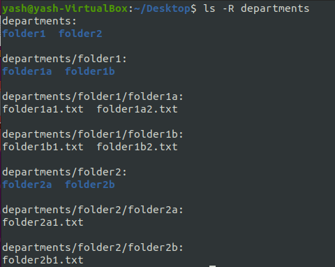
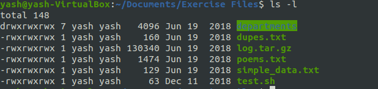

# Linux 

* General Command Syntax :
   - **Command  Option(s)   Arguments** 
   - 1. ls -lh /user/bin
     2. sort user.txt
     3. grep -i "needle" haystack

* File and Folders
   1. **file** -> syntax : file *filename*
        - Determines file type, examines file contents rather than its name or extension to identify what kind of file it is.
         - eg. file Linux_Notes
         - output ->  Linux_Notes : ASCII text
        
   2. **stat** -> syntax : stat *filename*
        -   display detailed information about file or file system like includes information like the file's size, permissions, owner, modification time, etc.
        -   eg. stat Linux_Notes
        -   output -> 

* **ls command working** :
   1. **ls -R departments** : The *ls -R departments*  lists all files and directories within a specified directory and does so recursively, i.e it will include the contents of all subdirectories as well.
        - output -> 
   2. **ls -l** : *ls -l* lists the contents of a directory in long format. This long listing format provides detailed information about each file or directory.
        - output->  
