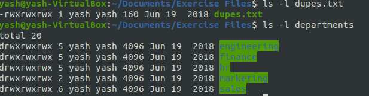
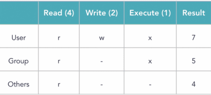

# Linux 

* General Command Syntax :
   - **Command  Option(s)   Arguments** 
   - 1. ls -lh /user/bin
     2. sort user.txt
     3. grep -i "needle" haystack

* File and Folders
   1. **file** -> syntax : file *filename*
        - Determines file type, examines file contents rather than its name or extension to identify what kind of file it is.
         - eg. file Linux_Notes
         - output ->  Linux_Notes : ASCII text
        
   2. **stat** -> syntax : stat *filename*
        -   display detailed information about file or file system like includes information like the file's size, permissions, owner, modification time, etc.
        -   eg. stat Linux_Notes
        -   output -> 

* **ls command working** :
   1. **ls -R departments** : The *ls -R departments*  lists all files and directories within a specified directory and does so recursively, i.e it will include the contents of all subdirectories as well.
        - output -> 
   2. **ls -l** : *ls -l* lists the contents of a directory in long format. This long listing format provides detailed information about each file or directory.
        - output->  

*   **Create and Remove Folders**

       1. Create Folder : *mkdir foldername* Creates folder in current working directory.
             - eg. *mkdir yash_docs*
             * if I want to create folder inside another folder of current working directory
                  -   *mdkir yash_docs/college/Marksheets*
             * if we want to create folder with sub folder inside it we need to pass option in command
                  - *mkdir -p yash_docs/college/DBMS_LAB/Practicals*
                    
       2. Remove Folder: *rmdir foldername* removes empty folder ( removes folder only when empty)
             - eg. *rmdir new_folder*

* **Copy File and Folder**
     1. Copying file: *cp originalfile copyfile* creates copy of *originalfile* with name *copyfile name*
        - eg 1. *cp file1.txt file1_copy.txt* 
             2. *cp file1.txt departments/images/file1_copy.txt

     2. Copying folder: *cp -r originalfolder copyfolder* creates copy of *originalfolder* with name copyfolder*
        - eg 1. *cp -r folder1 copyfolder1*
             2. *cp -r folder1 departments/images/copyfolder2*

* **Moving file and folder**

     1. *mv file1.txt file2.txt* : move file in same directory and save it with name file2.txt
     2. *mv file1.txt departments/images/file2.txt* : move file from current working directory to different directory with name file2.txt
     3. *mv departments/images/file1.txt* : move file from different directory to current working directory with name file2.txt.
     4.  *mv \*.txt departments/images* : moves all the textfiles to images folder.
     5.  *mv departments/images/\* .* : moves all the files and folders in images to current working directory.
        
  **_NOTE:_**  Same can be used for moving folders. eg: **mv folder1 folder2**

* **Remove file and folder**
     1. *rm file.txt* : removes file.txt
     2. *rm -r departments* : removes folder from current working directory

* **Find** : Used to search for files and directories within a directory hierarchy.
     - Syntax : *find <path> <options> <expression>
        - path : Specifies the directory or directories in which to start the search
        - options : Control the behavior of the find command, such as limiting the depth of the search or controlling the output.
        - expression : criteria for matching files or directories. These can include name patterns, file sizes, modification times, ownership, permissions, etc.

     - eg. *find . -name "po\*"* : searches for folder or directories with name starting from po in current working directory and its subdirectories
     - eg. *find ~/Documents/departments -name "\*d\*"* 
     - eg. *find ~/Documents/departments -type f -name ".txt"*

* **File Permissions** : File permissions determine who can read, write, or execute a file or directory
     - file permission string has 10 characters.
          - first character indicate file type
          - next nine characters represents the permissions divided into three sets of three characters
               - Owner (user) permissions
               - Group permissions
               - Others permissions
          - eg. *ls -l sample.txt*
          - output->  
      - Changing file permission using *chmod* (change permissions on a file by modifying file mode bits) 
            1. using octal notation
            2. using symbolic notation
            
       - **OCTAL FILE PERMISSIONS**

          
      
      
